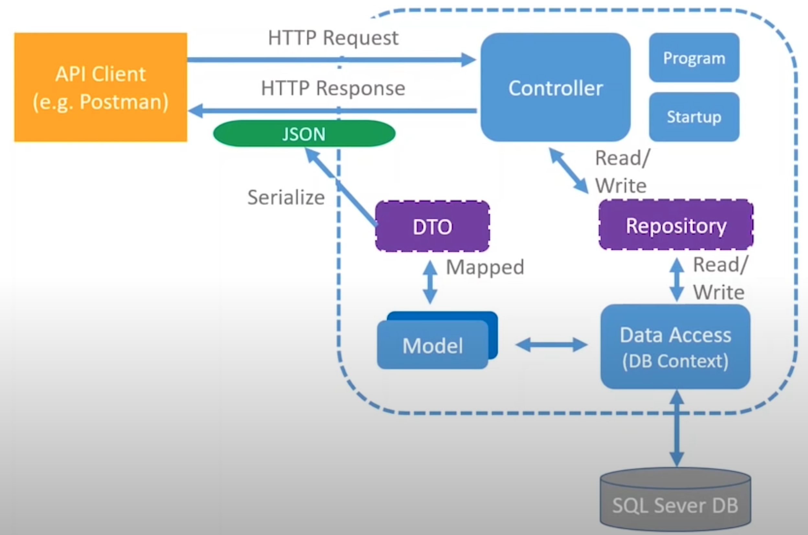

# Wiki Snippets
This .NET Core 3.1 API mean to provide a interface for my code snippet repository. 
Before this, I use to write all my snippets on OneNote, but as it grows, it became a completely mess, so, following this [Les Jackson video](https://www.youtube.com/watch?v=fmvcAzHpsk8), I built this API aiming to learn and practice .NET Core and solve my problem with snippets code as well.

## API Architecture

## Concepts

It was use **MVC** architecture to this **REST API** with 6 simple CRUD operations. Used **Repository Pattern** with **Dependance Injection** on services. 
To talk with the MSSQL Database, it was used **Entity Framework** (Code First) and **DTOs** to transfer data between layers.

## Contribute
You are free to use or contribute with this simple project. Just send me a PR :)

Hope it could be usefull to you too. Have fun!